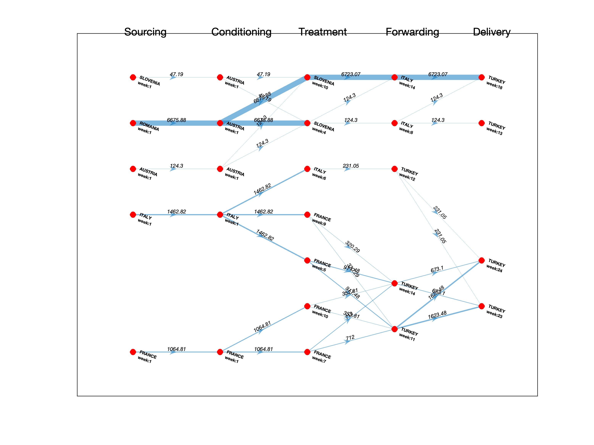
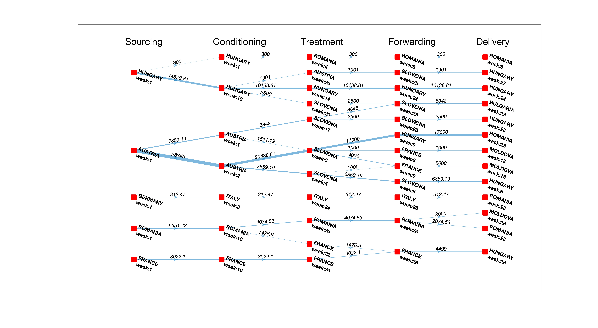

# Network Flow Trace Back Problem

This project focuses on solving network flow trace back problems given flows from source country to demand country for different demands. Each flow from source country to demand country should go through 5 different processing steps: Sourcing, Conditioning, Treatment, Forwarding and Delivery. We would like to trace back each demand to its source. Below is an example of given input network flow, wehre each node represents a process (i.e., one row of data), each edge represents a possible outgoing flow, and edge weight reperesents the maximum possible outflow. Obviously, the incoming and outgoing flows from each node are not equal, since edge weights do not reperesent the actual flows, but they are just maximum possible values based on given data.

**Figure Description: A sample of network with given flow data.**

## Proposed Solutions

Two solution techniques are developed:

- (1) Depth-First Search (DFS) Algorithm, and
- (2) Two-Stage Linear Programing (LP) Optimization Model

**Depth-First Search (DFS) Algorithm:** It reads input data from an Excel file named 'NetworkFlowProblem-Data.xlsx', processes the data, and generates the trace back for each demand based on the given order of processing steps. The script utilizes the pandas library to handle data frames efficiently. The developed algorithm is a heuristic search where each is traced back to its source. To ensure that every demand is traced back to its source, in each iteration the algorithm keeps track of all previously identified paths, and if a demand could not be traced back to its source, in the next iteration it re-orders the demands, and repeat the steps for tracing back. This process is repeated until all demands could be traced back to their source.

**Two-Stage Linear Programing (LP) Optimization Model:** The idea is to identify the graph where the edge weights in the graph represents the actual capacity, or flow in the network. Knowing the actual flows of edges, turns the problem into well-known "Maximum FLow" optimization problem, where there exist several efficient solution algorithms. It should be noted that in our case, the network is a maximum flow with multiple sources and sinks, however, the solution tecnhiques remain the same, by using a trick to introduce dummy (i.e., virtual) single source and single sink node.

It reads input data from an Excel file named 'NetworkFlowProblem-Data.xlsx'. The problem is mathematically modeled as a Graph where nodes represent the given flows, and edges represent amount of flows. Following the "Flow Conservation Law" a LP model is developed to ensure that all the incoming flows are equal to the outgoing flows, while ensuring the delivery amount is satisfied at demand nodes. Based on the solution, the model generates a figure showing the entire flow network.

**Figure Description: An example of a network flow from source country to demand country for different demands (results of LP model).**

## Requirements

- Python 3.9.17, os, pandas
- MATLAB 2023a & Gurobi 10.0.0 (optional if you would like to use the two-stage optimization model)

# Depth-First Search (DFS) Algorithm

## How to run?

1. Ensure that the 'NetworkFlowProblem-Data.xlsx' file is located in the 'input' folder. Or you could provide your excel file with a sheet name that starts with "Input" in the 'input' folder.

2. **Run the Python script 'main.py' in the terminal**.

3. The script will prompt for the name of the Excel file. Enter the file name (followed by .xlsx) and press 'Enter'. In case you would like to use the default file you could **type 'skip'** and it uses 'NetworkFlowProblem-Data.xlsx' if found in the 'input' folder. The script will then show the list if sheets starting with 'Input<>', and then you need to type in which sheetname to use.

4. The script will then perform the trace back process for the demands and generate the results saved in 'output.xlsx' file in the root directory.

5. If the trace back is successful for all demands, the script will display "Successfully traced back all demands to source by the given order."

6. If the trace back fails for any demand, the script will display "Failed to trace back all demands by given order."

7. The script will also create additional attempts if the trace back fails, ensuring a successful trace back for all demands.

8. The sample of outputs can be found in folder 'sample of outputs'.

## Overview of algorithm

1. Import the necessary libraries, including pandas and custom utility functions from different modules.

2. Read the input data from the Excel file 'NetworkFlowProblem-Data.xlsx' and convert column names to lowercase. This is jusy to ensure that all column names matches with the ones in the code.

3. Define the 'delta' variable, which represents a tolerance for small floating-point discrepancies. This is to ensure that floating numbers after being imported from excel file, does not violate meeting the demands.

4. Define the processing steps in a list: ['Sourcing', 'Conditioning', 'Treatment', 'Forwarding', 'Delivery']. This is the ordinal list of all processes, and it is assumed that these steps should exist for all demands.

5. Define utility functions such as 'create_combined_dataframe', 'sort_formatted_out', 'write_output_into_excel', and 'subtract_amount_if_exists' to perform various data processing and output operations.

6. Sort the input data frame based on the 'week' column in descending order. This is just to speed up things as demands are more likely to happen at a later time, and it would be better to start from the latest demand.

7. Identify demands from the sorted data frame based on the last processing step ('Delivery').

8. Define the 'trace_back_demand_to_source' function to trace back each demand to its source based on the processing steps. It uses the 'used_resources' data frame to keep track of the resources used for each demand.

9. The 'trace_back_demand_to_source' function iterates over each demand and checks for the availability of resources to trace back the demand. It constructs a result with information about the demand and the traced-back resources for each processing step.

10. The script then creates a list of all combined data frames that store the trace back results for each demand.

11. The script enters a loop to randomly sample the demands and perform the trace back process until all demands can be successfully traced back or a limit of attempts is reached.

12. The output of the trace back is written into an Excel file named 'output.xlsx' in the root directory.

# Two-Stage Linear Programing (LP) Optimization Model

1. Change directory to "Two-Stage Optimizatio Model (in-progress)"
2. run optimization_v101.m

# Additional Information

If you have questions, do not hesitate to reach out at shahryar.monghasemi@gmail.com
